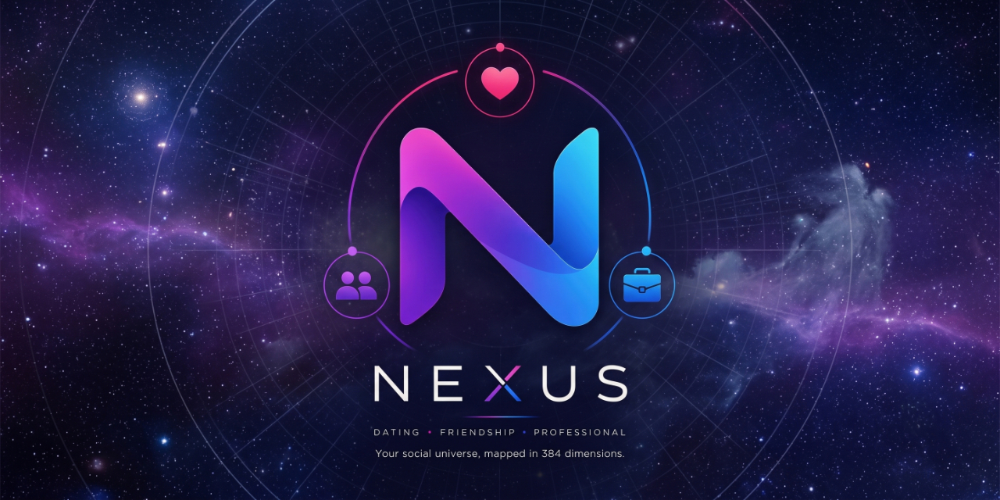

# Nexus



[](https://github.com/devakesu/Nexus/releases/latest)
[](https://www.gnu.org/licenses/agpl-3.0)
[](https://scorecard.dev/viewer/?uri=github.com/devakesu/Nexus)
[](https://github.com/devakesu/Nexus/actions/workflows/codeql.yml)
[](https://slsa.dev)
[](https://github.com/devakesu/Nexus/attestations)
[](https://www.bestpractices.dev/projects/13766)
[](.github/workflows/release.yml)

<!-- markdownlint-disable MD033 -->
<p align="center">
  
  
  
  
</p>
<p align="center">
  
  
  
</p>
<p align="center">
  
  
  
</p>
<!-- markdownlint-enable MD033 -->

## Overview

**Nexus** is a cosmic-themed, authentic social discovery app built to connect with new people nearby in real-world moments. Unlike conventional swipe-card dating apps, Nexus emphasizes spontaneous, in-the-moment human connections across multiple social dimensions - whether you are looking for new friends, professional connections, or romance.

Nexus ships in two distinct product flavors from a single unified codebase:

- **`nexus` (General Audience)**: Open to any email domain for general social discovery.
- **`nexus_mec` (Campus-Gated)**: Gated strictly to verified campus email domains (`@mec.ac.in`), creating a trusted, student-only community experience.

Engineered with a BeReal-style authentic and spontaneous brand personality, Nexus pairs vector-based similarity algorithms (`Nexus_Engine`) with real-time Spotify audio taste matching. Crucially, **safety is built as a first-class product surface**, featuring a complete Safety Center, active meetup safety check-in alerts, and Signal Protocol end-to-end encrypted (E2EE) chats.

## 📲 Get the Mobile App

Choose the version that fits your community:

<!-- markdownlint-disable MD033 -->
<table align="center" border="0" cellpadding="10">
  <tr>
    <td align="center">
      <strong>Nexus (Coming SOON)</strong><br />
      <a href="https://play.google.com/store/apps/details?id=com.devakesu.apps.nexus" target="_blank" rel="noopener noreferrer">
        
      </a>
    </td>
    <td align="center">
      <strong>Nexus MEC (Campus-Gated)</strong><br />
      <a href="https://play.google.com/store/apps/details?id=com.devakesu.apps.nexus.mec" target="_blank" rel="noopener noreferrer">
        
      </a>
    </td>
  </tr>
</table>
<!-- markdownlint-enable MD033 -->

## 🎯 Key Vibes

- **Orbit Social Discovery 🌌**: An intuitive visual discovery space ("the Orbit screen") connecting nearby people with mode-specific signal colors: **Dating** (`#FF4F81`), **Friends** (`#A45E00`), and **Professional** (`#007E6D`).
- **Spotify Taste Signal 🎵**: Express your personality through shared musical vibes with real-time Spotify top tracks and artists, securely encrypted.
- **Signal Protocol E2EE Chat 🔐**: Industry-standard Double Ratchet end-to-end encryption (`libsignal_protocol_dart`) ensuring messaging conversations remain strictly confidential between sender and receiver.
- **First-Class Safety Center 🛡️**: Comprehensive safety tools including active meetup check-in alerts, emergency contact notifications, crisis helplines, transparent report/block controls, and account deletion flows.
- **Dual Community Flavors 🏫**: One codebase powering both general-audience (`nexus`) and campus-restricted (`nexus_mec`) experiences under the cohesive **Constellation Social** design system.
- **Anti-Tapjacking & Hardware Protection 📱**: Android `FLAG_SECURE` integration prevents screen recording, unauthorized overlays, and screenshots during sensitive account operations.
- **Offline-First & Local Sync ⚡**: High-performance local caching with Drift (SQLite), reactive Flutter Riverpod 3 state management, and seamless background notification schedulers.

### 🔐 Security & Reliability

- **App Check Attestation**: Firebase App Check with Play Integrity (Android) and DeviceCheck (iOS) blocks unauthorized bot traffic and API tampering.
- **Zero-Trust Bridge**: Signal Protocol E2EE key exchange and double-ratchet encrypted messaging payloads.
- **AES-256-GCM Encryption**: OAuth tokens and sensitive credentials stored with hardware-backed encryption at rest.
- **Row Level Security (RLS)**: Database-level tenant isolation policy enforced across PostgreSQL tables in Supabase.
- **Rate Limiting & Protection**: Per-IP and per-user rate limiting via SlowAPI backed by Redis caching.
- **Supply Chain Transparency**: Signed Docker images using Sigstore Cosign (keyless OIDC), SLSA Level 3 provenance attestations, SBOM generation (CycloneDX), and continuous Trivy & CodeQL security scans.

## 🛠️ Tech Stack

### Backend & API Framework

- **FastAPI 0.139.2** - High-performance Python web framework with async support
- **Uvicorn 0.51.0** - Lightning-fast ASGI server implementation
- **Python 3.11+** - Modern Python with strict typing and bytecode determinism
- **Pydantic 2.13.4** - Data validation and settings management using Python type annotations
- **PyJWT 2.13.0** - Secure JSON Web Token handling
- **SlowAPI 0.1.10** - IP/user-based rate limiting middleware
- **APScheduler 3.11.3** - Background notification and reminder scheduler
- **Sentry SDK 2.66.0** - Real-time error tracking and telemetry with PII scrubbing

### Database & Auth

- **Supabase (PostgreSQL 15+)** - Database backend with Row Level Security (RLS) and pgvector
- **Supabase Auth** - JWT authentication system
- **Redis / Upstash 8.0.1** - Fast in-memory caching and rate-limiting storage

### Mobile Framework & State

- **Flutter SDK ^3.12.1** - Cross-platform mobile development for Android & iOS
- **Flutter Riverpod v3.3.2** - Reactive state management with code generation (`riverpod_annotation`)
- **GoRouter v17.3.0** - Declarative routing engine
- **Drift v2.34.2** - Reactive persistence library for SQLite in Flutter
- **Flutter Secure Storage v10.3.1** - Hardware-backed secret storage (Android Keystore / iOS Keychain)

### UI & Aesthetics

- **Constellation Social Design System** - Cosmic design language with curated color system
- **Google Fonts** - *Orbitron* (Display), *Manrope* (Headlines/Titles), *Inter* (Body), *JetBrains Mono* (Technical labels)
- **Lucide Icons Flutter v3.1.15** - Modern, cohesive icon system
- **Flutter Animate v4.5.2** - Micro-animations and subtle visual state transitions

### Security & Native Integrations

- **Firebase App Check v0.4.5+2** - Play Integrity & DeviceCheck device attestation
- **`libsignal_protocol_dart` 0.8.2** - Signal Protocol end-to-end encryption for chat
- **Cryptography & Encrypt** - Native cryptographic primitives and AES-256-GCM encryption
- **Google ML Kit Image Labeling** - On-device AI image detection and tagging
- **Geolocator & Google Maps** - Location Services & interactive map rendering
- **Just Audio & Record** - High-fidelity audio playback and voice recordings

### DevOps & Build Pipeline

- **Docker** - Deterministic reproducible container builds with `SOURCE_DATE_EPOCH`
- **Infisical CLI v0.43.84** - Two-tier secret management fetching secrets into memory at runtime
- **Sigstore Cosign** - Keyless OIDC container image signing
- **SLSA Level 3** - Supply chain security with provenance attestation
- **Trivy Scanner** - Container image vulnerability scanning
- **CodeQL & OpenSSF Scorecard** - Continuous security and code quality analysis
- **Pytest 9.1.1** - Automated unit and integration test suite

## 📁 Project Structure

```text
app/                   # FastAPI Backend Application
├── api/               # REST API endpoints (discovery, chats, safety, spotify, likes, sync)
├── core/              # Config, security, rate limiter, cache, Sentry scrubbing
├── db/                # Supabase client, chat key handlers, database queries
└── services/          # Business logic, notification dispatchers, reminder schedulers
mobile/                # Native Flutter Mobile Application
├── android/           # Native Android configuration (App Check, FLAG_SECURE)
├── assets/            # App icons, soundscapes, ML Kit TensorFlow models
├── ios/               # Native iOS configuration (DeviceCheck, Keychain)
├── lib/               # Dart application logic
│   ├── config/        # Environment configurations & constants
│   ├── features/      # Feature-specific modules (Profile, Spotify signals)
│   ├── navigation/    # GoRouter declarative routing setup
│   ├── providers/     # Riverpod reactive state providers
│   ├── screens/       # Application views (Orbit, Safety Center, Meetup Safety, Chats)
│   ├── services/      # Signal E2EE, local Drift DB, API client, SecureStorage
│   └── theme/         # Constellation Social design tokens and typography
└── test/              # Flutter unit and widget test suite
mocks/                 # Mock engine for reproducible containerized testing
Nexus_Engine/          # Submodule vector similarity matching & social engine
scripts/               # Maintenance, database migration, and release scripts
supabase/              # Database schema migrations, pgvector indexes, & RLS policies
tests/                 # Pytest suite for API endpoints, security, and moderation
```

## 🌌 Constellation Social Design System

Nexus features a cosmic design system called **Constellation Social** built around relationship modes and high-legibility safety surfaces.

### Core Color Palette

| Token | Hex | Usage |
| :--- | :--- | :--- |
| **Primary Teal** | `#0891B2` | Brand identity, primary interactive elements |
| **Pulsar Pink** | `#FF7597` | Hero call-to-actions, accent highlights |
| **Mode Dating** | `#FF4F81` | Dating mode navigation, chat indicators, filter tags |
| **Mode Friends** | `#A45E00` | Friends mode navigation, chat indicators, filter tags |
| **Mode Professional** | `#007E6D` | Professional mode navigation, chat indicators, filter tags |
| **Safety Blue** | `#0284C7` | Safety Center, check-in alerts, verified badges |
| **Safety Teal** | `#0D9488` | Meetup-safety guidance, crisis helpline surfaces |

### Typography Hierarchy

- **Display**: *Orbitron* (Weight 900) - Used for major brand headlines and cosmic accents.
- **Headline / Title**: *Manrope* (Weight 800 / 700) - Section headers and card titles.
- **Body**: *Inter* (Weight 400) - Readable body copy, chat messages, and guidance notes.
- **Mono**: *JetBrains Mono* (Weight 500) - System status codes, safety verification IDs, and timestamps.

## 🚀 Getting Started

### Prerequisites

- **Docker Desktop** (with WSL2 backend enabled)
- **WSL2** (Linux distribution such as Ubuntu/Debian)
- **VS Code or Antigravity IDE** (with Dev Containers extension)

### 🐳 Dev Container Environment Setup (Recommended)

Nexus provides an isolated, reproducible Dev Container (`.devcontainer/Dockerfile`) equipped with pre-compiled Python 3.12, Flutter SDK 3.44, Node 24, Deno 2.9, CLI tools, and automatic IDE extension syncing.

#### 1. Enable Windows SSH Agent (Host)

Run PowerShell as Administrator or user to enable the OpenSSH agent service and load your SSH/signing keys:

```powershell
Set-Service -Name ssh-agent -StartupType Automatic
Start-Service ssh-agent
ssh-add $env:USERPROFILE\.ssh\id_ed25519
```

#### 2. Bridge SSH Agent to WSL2

In WSL2, install `socat`, download `npiperelay`, and bridge the Windows SSH pipe to Linux:

```bash
sudo apt update && sudo apt install -y socat

# Download npiperelay to bridge Windows named pipes to Linux sockets
curl -s https://api.github.com/repos/jstarks/npiperelay/releases/latest \
| grep "browser_download_url.*zip" \
| cut -d : -f 2,3 \
| tr -d \" \
| wget -qi - -O /tmp/npiperelay.zip

sudo unzip -o /tmp/npiperelay.zip npiperelay.exe -d /usr/local/bin/
sudo chmod +x /usr/local/bin/npiperelay.exe
rm /tmp/npiperelay.zip

# Bridge Windows SSH Agent Pipe to Linux Socket
export SSH_AUTH_SOCK="$HOME/.ssh/agent.sock"

# Check if socket is active by attempting to communicate with it
if ! socat -u /dev/null UNIX-CONNECT:"$SSH_AUTH_SOCK" 2>/dev/null; then
    rm -f "$SSH_AUTH_SOCK"
    mkdir -p "$HOME/.ssh"
    (nohup socat UNIX-LISTEN:"$SSH_AUTH_SOCK",fork EXEC:"npiperelay.exe -ei -s //./pipe/openssh-ssh-agent",nofork >/dev/null 2>&1 &)
fi
```

#### 3. Clone Repository in WSL2

Clone the repository in your WSL2 home or projects directory:

```bash
git clone https://github.com/devakesu/Nexus.git
cd Nexus
```

#### 4. Build & Run Sandbox Container

Build the dev container image and launch the sandbox container with mapped ports and volume mounts:

```bash
# Build dev container image
docker build -t nexus-sandbox .devcontainer

# Launch sandbox container
docker run -d --name Nexus_Sandbox \
  --restart unless-stopped \
  -v "$(pwd):/nexus" \
  -v /var/run/docker.sock:/var/run/docker.sock \
  -v "$HOME/.ssh/agent.sock:/run/host-services/ssh-auth.sock" \
  -e SSH_AUTH_SOCK="/run/host-services/ssh-auth.sock" \
  -p 3000:3000 \
  -p 8000:8000 \
  -p 8080:8080 \
  -p 4000:4000 \
  -p 5001:5001 \
  -p 8081:8081 \
  -p 8085:8085 \
  -p 8181:8181 \
  -p 9099:9099 \
  -p 54321:54321 \
  -p 54322:54322 \
  -p 54323:54323 \
  nexus-sandbox
```

#### 5. Attach IDE & Initialize Workspace

1. Open **VS Code** or **Antigravity IDE**.
2. Open Command Palette (`Ctrl+Shift+P` / `Cmd+Shift+P`) $\rightarrow$ select **Attach to Running Container** $\rightarrow$ **`Nexus_Sandbox`**.
3. Open directory **`/nexus`** inside the container.
4. Run workspace initialization script in the integrated terminal:

   ```bash
   ~/init_workspace.sh
   ```

   *(Enter Git Name and Email when prompted to configure local commit signing and SSH identity).*
5. Run **`Developer: Reload Window`** in VS Code / Antigravity to refresh environment variables and extension integrations.

### 🔐 Secret Management & Database Initialization

Before starting the API backend or mobile client, authenticate with Infisical and link your Supabase database project:

#### 1. Infisical CLI Login

Authenticate Infisical CLI to allow runtime secret injection:

```bash
infisical login
```

#### 2. Supabase Project Setup & Linking

Authenticate Supabase CLI and link the repository schema to your Supabase project:

```bash
# Log in to Supabase CLI
supabase login

# Link your workspace to your Supabase project instance
supabase link --project-ref <your-supabase-project-ref>

# Push local schema migrations to database
supabase db push
```

### Running Backend API

Once Infisical and Supabase are authenticated:

1. **Run API Server with Injected Secrets**:

   ```bash
   infisical run --env=dev --projectId=xxxx --path /public --path /runtime -- .venv/bin/uvicorn app.main:app --reload --reload-dir app --host 0.0.0.0 --port 8000 --ssl-certfile .certificates/localhost.pem --ssl-keyfile .certificates/localhost-key.pem
   ```

   Visit `http://localhost:8000/docs` for the interactive Swagger documentation.

### Running Mobile App

1. **Navigate to Mobile Directory**:

   ```bash
   cd mobile
   flutter pub get
   ```

2. **Run General Audience Flavor (`nexus`)**:

   ```bash
   infisical run --env=prod --projectId=xxxx --path /public -- sh -c '
    export DART_VM_OPTIONS="--bind-address=0.0.0.0"
    flutter run \
      --flavor nexus \
      --host-vmservice-port=8181 \
      --dart-define=APP_DOMAIN="$APP_DOMAIN" \
      --dart-define=BACKEND_URL="$BACKEND_URL" \
      --dart-define=GOOGLE_IOS_CLIENT_ID_NEXUS="$GOOGLE_IOS_CLIENT_ID_NEXUS" \
      --dart-define=GOOGLE_IOS_CLIENT_ID_NEXUS_MEC="$GOOGLE_IOS_CLIENT_ID_NEXUS_MEC" \
      --dart-define=SUPABASE_URL="$SUPABASE_URL" \
      --dart-define=SUPABASE_PUBLISHABLE_KEY="$SUPABASE_PUBLISHABLE_KEY" \
      --dart-define=GOOGLE_WEB_CLIENT_ID="$GOOGLE_WEB_CLIENT_ID" \
      --dart-define=SPOTIFY_CLIENT_ID="$SPOTIFY_CLIENT_ID" \
      --dart-define=SPOTIFY_REDIRECT_URI_NEXUS="$SPOTIFY_REDIRECT_URI_NEXUS" \
      --dart-define=GOOGLE_PLACES_API_KEY="$GOOGLE_PLACES_API_KEY"
   '
   ```

3. **Run Campus-Gated Flavor (`nexus_mec`)**:

   ```bash
   infisical run --env=prod --projectId=xxxx --path /public -- sh -c '
    export DART_VM_OPTIONS="--bind-address=0.0.0.0"
    flutter run \
      --flavor nexus_mec \
      --host-vmservice-port=8181 \
      --dart-define=APP_DOMAIN="$APP_DOMAIN" \
      --dart-define=BACKEND_URL="$BACKEND_URL" \
      --dart-define=GOOGLE_IOS_CLIENT_ID_NEXUS="$GOOGLE_IOS_CLIENT_ID_NEXUS" \
      --dart-define=GOOGLE_IOS_CLIENT_ID_NEXUS_MEC="$GOOGLE_IOS_CLIENT_ID_NEXUS_MEC" \
      --dart-define=SUPABASE_URL="$SUPABASE_URL" \
      --dart-define=SUPABASE_PUBLISHABLE_KEY="$SUPABASE_PUBLISHABLE_KEY" \
      --dart-define=GOOGLE_WEB_CLIENT_ID="$GOOGLE_WEB_CLIENT_ID" \
      --dart-define=SPOTIFY_CLIENT_ID="$SPOTIFY_CLIENT_ID" \
      --dart-define=SPOTIFY_REDIRECT_URI_NEXUS="$SPOTIFY_REDIRECT_URI_NEXUS" \
      --dart-define=GOOGLE_PLACES_API_KEY="$GOOGLE_PLACES_API_KEY"
   '
   ```

## ⚡ Performance & Security Optimizations

- **Bytecode Determinism**: Container builds enforce `PYTHONDONTWRITEBYTECODE=1` and `SOURCE_DATE_EPOCH` for 100% reproducible artifacts.
- **In-Memory Secret Injection**: Secrets are injected directly into process memory at launch via Infisical, preventing credentials from touching the filesystem.
- **Local Persistence with Drift**: Offloads user profile reads and chat logs to an encrypted local SQLite database, resulting in sub-millisecond screen transitions.
- **Anti-Tapjacking Hardware Guard**: Prevents malicious Android apps from drawing overlays or capturing touch events over Account/Login, Safety Center and Check-in verification screens.

## 🧪 Testing & Quality

Nexus enforces strict testing and code analysis standards across both backend and mobile codebases.

### 🐍 Backend Testing (Pytest)

Run the backend unit, integration, and security test suite:

```bash
.venv/bin/pytest tests/
```

Tests cover vector orbit calculations, moderation security, campus email validation, and chat key exchanges.

### 📱 Mobile Testing (Flutter)

Run mobile unit and widget tests:

```bash
cd mobile
flutter test
```

Enforces code style and best practices using `very_good_analysis`.

### 🛡️ Security Scans

- **CodeQL**: Automated SAST workflow detecting potential security flaws.
- **Trivy**: Vulnerability scanning on container base layers and dependencies.
- **OpenSSF Scorecard**: Continuous automated monitoring of repository security posture.

## 🔒 Security Policy

Security is fundamental to Nexus. If you discover a vulnerability, please disclose it responsibly via **[GitHub Private Vulnerability Reporting](https://github.com/devakesu/Nexus/security/advisories/new)** or by contacting **[admin@nexus.devakesu.com](mailto:admin@nexus.devakesu.com)**.

For complete details on encryption standards, hardware attestation, and script injection protection, read **[SECURITY.md](SECURITY.md)**.

## 🚀 Deployment

### 🐳 Docker Backend Deployment

Nexus features a reproducible Docker build setup with multi-stage security checks:

```bash
docker build -t nexus-orbit .
docker run -p 8000:8000 -e INFISICAL_PROJECT_ID="your_project_id" INFISICAL_TOKEN="your_token" INFISICAL_ENGINE_TOKEN="private_engine" nexus-orbit
```

Release builds are automatically signed with Sigstore Cosign and submitted with SLSA Level 3 provenance attestations.

### 📱 Mobile App Releases

Build signed production release packages:

```bash
# Android APK / App Bundle
cd mobile
flutter build appbundle --flavor nexus -t lib/main.dart
flutter build appbundle --flavor nexus_mec -t lib/main.dart

# iOS IPA
flutter build ipa --flavor nexus -t lib/main.dart
```

Direct Google Play Links:

- [Nexus (General Audience - Coming SOON!)](https://play.google.com/store/apps/details?id=com.devakesu.apps.nexus)
- [Nexus MEC (Campus-Gated)](https://play.google.com/store/apps/details?id=com.devakesu.apps.nexus.mec)

## ❓ Frequently Asked Questions

**What is the difference between `nexus` and `nexus_mec` flavors?**
Both flavors share 100% of the codebase and visual design language. The `nexus` flavor is open for general social discovery across any email domain, whereas the `nexus_mec` flavor gates registration strictly to `@mec.ac.in` student email addresses.

**How does End-to-End Encryption (E2EE) work in chats?**
Nexus uses the Signal Protocol (`libsignal_protocol_dart`). Public identity keys and pre-keys are registered on the backend via `/chat-keys`, while conversation session keys are negotiated directly on-device using a double ratchet algorithm. Messages are encrypted before leaving your phone and can only be decrypted by the intended recipient.

**How does Nexus protect user safety during real-world meetups?**
Nexus includes a dedicated Safety Center with active Meetup Check-in alerts. Users can set up safety timers when meeting someone in person; if the timer expires without check-in, an emergency alert can be dispatched to pre-selected trusted contacts.

## 🤝 Contributing

Contributions are welcome! Please review **[CONTRIBUTING.md](CONTRIBUTING.md)** for detailed instructions on code conventions, commit messages, and workflow rules.

## 👥 Maintained by

- **[Devanarayanan](https://devakesu.com) - [GitHub](https://github.com/devakesu)**

## 📄 License

This project is licensed under the **[GNU Affero General Public License v3.0](LICENSE)**.

***Thank you for checking out Nexus! Stay safe, connect authentically, and explore your constellation! 🌌✨***
